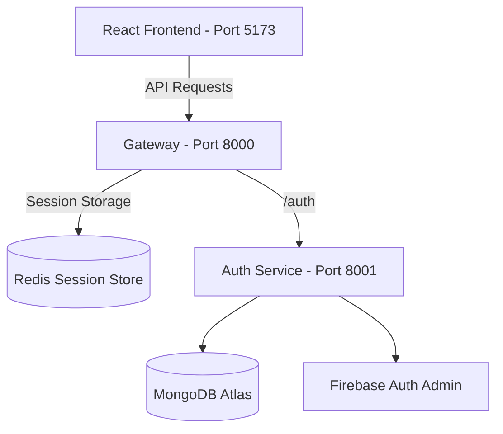

# CortexAI - Microservice AI Agent Platform

CortexAI is a microservice-based AI agent platform designed to deliver multiple AI capabilities (Conversational Chat, Code Generation & Previews, PDF/PPT Generation, Image Generation, Vision Analysis, and PDF RAG Similarity Search) with a robust distributed architecture.

---

## 🏛️ Architecture Overview

The application is structured as a decoupled microservice network coordinated by an API Gateway:



---

## 🛠️ Technology Stack

### 1. Frontend
* **Core Framework:** React 19 + Vite (Fast Build Tool & HMR)
* **Styling:** Tailwind CSS v4 (Custom UI design system)
* **API Client:** Axios
* **Authentication:** Firebase Client SDK (Social Login, Session management)

### 2. Backend & Gateway
* **Gateway API:** Node.js + Express + `express-http-proxy`
* **Auth Service:** Node.js + Express + MongoDB (via Mongoose) + Firebase Admin SDK
* **Shared Modules:** Node.js + `ioredis` (Redis Client Wrapper)
* **Process Management:** Nodemon (Development Auto-Reload)

### 3. Infrastructure & Databases
* **Session Store:** Redis (Docker containerized)
* **Primary Database:** MongoDB Atlas (Cloud Document Store)
* **Auth Provider:** Firebase Authentication (User identity & Token verification)

---

## 📂 Codebase Directory Layout

```text
syncagents-ai/
├── backend/
│   ├── gateway/                  # API Gateway (Port 8000) - Proxy routing & CORS
│   ├── shared/                   # Shared modules (e.g. Redis Client Wrapper)
│   ├── services/
│   │   ├── auth/                 # Auth Service (Port 8001) - MongoDB & Firebase Auth
│   └── docker-compose.yml        # Local Redis service configuration
└── frontend/                     # React + Vite + Tailwind CSS SPA (Port 5173)
```

---

## 🔐 Environment Variables Configuration

To run this project locally, configure the following `.env` files:

### 1. Frontend (`frontend/.env`)
```env
VITE_FIREBASE_API=your_firebase_client_api_key
VITE_SERVER_URL=http://localhost:8000
```

### 2. Gateway (`backend/gateway/.env`)
```env
PORT=8000
AUTH_SERVICE_URL=http://localhost:8001
FRONTEND_URL=http://localhost:5173
```

### 3. Auth Service (`backend/services/auth/.env`)
```env
PORT=8001
MONGODB_URL=your_mongodb_connection_string
```
*Note: Make sure to place your Firebase Admin Service Account Key JSON file inside `backend/services/auth/serviceAccountKey.json`.*

---

## 🚀 Running the Project Locally

### Step 1: Start Redis
Run the Redis container using Docker Compose:
```bash
cd backend
docker compose up -d
```

### Step 2: Set Up Shared Modules
Install dependencies for the shared Node.js modules:
```bash
cd backend/shared
npm install
```

### Step 3: Start Backend Services
For each directory, install dependencies and run:

1. **Gateway**:
   ```bash
   cd backend/gateway
   npm install
   npm run dev
   ```

2. **Auth Service**:
   ```bash
   cd backend/services/auth
   npm install
   npm run dev
   ```

### Step 4: Start Frontend
```bash
cd frontend
npm install
npm run dev
```
Open your browser to [http://localhost:5173](http://localhost:5173) to access the application.
